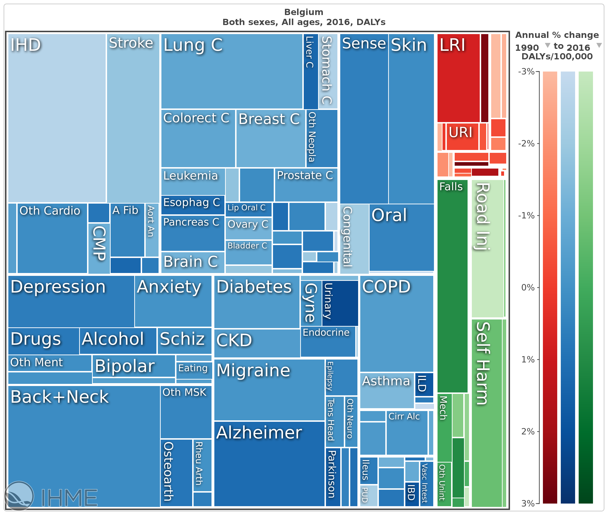

```{r setup, include=FALSE}
knitr::opts_chunk$set(echo = FALSE)
```

## Agenda

- Motivating example
- Individual observations
- Quantiles

# Motivating Example

## Motivating Example

What is the contribution of current red meat consumption levels to the colorectal cancer disease burden?

## Motivating Example

What is the contribution of current red meat consumption levels to the colorectal cancer disease burden?

**Comparative Risk Assessment**

Systematic evaluation of the changes in burden of disease which would result from modifying the population distribution of exposure to a **theoretical minimum risk exposure distribution (TMRED)** that would imply minimum health loss, keeping all other risk factors unchanged

Calculation of **Population Attributable Fraction**

$$PAF=\frac{\int{P(x)RR(x)dx}-\int{P'(x)RR(x)dx}}{\int{P(x)RR(x)dx}}$$

## Motivating Example

What is the contribution of current red meat consumption levels to the colorectal cancer disease burden?

**Comparative Risk Assessment**

Systematic evaluation of the changes in burden of disease which would result from modifying the population distribution of exposure to a **theoretical minimum risk exposure distribution (TMRED)** that would imply minimum health loss, keeping all other risk factors unchanged

Calculation of **Attributable Burden**

$$AB=B*PAF$$


## Motivating Example

What is the contribution of current red meat consumption levels to the colorectal cancer disease burden?

**Data requirements**

- Current disease burden of colorectal cancer
- Relative risk function
- Current red meat consumption levels
- Ideal consumption level (TMREL)

## Motivating Example | Colorectal cancer disease burden {.columns-2}

```{r gbd, out.width = "100%"}
 
```


Institute for Health Metrics and Evaluation

Global Burden of Disease, 2016

- 8,863 new cases
- 3,725 deaths
- 57,283 DALYs

## Motivating Example | Relative risk function

<b>Food groups and risk of colorectal cancer.</b> Schwingshackl L, Schwedhelm C, Hoffmann G, Knüppel S, Laure Preterre A, Iqbal K, Bechthold A, De Henauw S, Michels N, Devleesschauwer B, Boeing H, Schlesinger S. Int J Cancer. 2018 May 1;142(9):1748-1758. [doi: 10.1002/ijc.31198](https://doi.org/10.1002/ijc.31198)

<br>

Non-linear dose-response function

[dosresmeta](https://alecri.github.io/software/dosresmeta.html) package

## Motivating Example | Relative risk function

```{r doseresponse, message=FALSE, warning=FALSE}
source("doseresponse.R")
par(mar = c(4, 4, 0, 0))
plot_dosres(fit_crc, crc)
```

## Motivating Example | Red meat consumption levels

FFQ and 24h recalls

- Statistical Program to Assess Dietary Exposure (SPADE)


Individual observations

- Bootstrap

- Method of moments

- Maximum likelihood


Quantiles

- Optimization


## Which distribution?

Main characteristic: non-negative, continuous

```{r plotdist}
## plot distributions with same mean and SD
m <- 200
s <- 100
v <- s^2
b_gamma <- m/v
a_gamma <- m*b_gamma
a_lnorm <- log(m)-0.5*log((s/m)^2+1)
b_lnorm <- sqrt(log((s/m)^2+1))
a_weibull <- (s/m)^-1.086
b_weibull <- m / gamma(1+1/a_weibull)

par(mar = c(2, 4, 0, 0))
curve(dgamma(x, a_gamma, b_gamma),
      to = 800,
      col = "red",
      lwd = 2,
      xlab = NA,
      ylab = "density",
      ylim = c(0, 0.0055))
curve(dlnorm(x, a_lnorm, b_lnorm),
      add = TRUE,
      col = "blue",
      lwd = 2)
curve(dweibull(x, a_weibull, b_weibull),
      add = TRUE,
      col = "green",
      lwd = 2)
legend("topright",
       legend = c("Gamma", "Log-normal", "Weibull"),
       col = c("red", "blue", "green"),
       lty = 1)
```

## Which distribution? | Excessive zeros

Mixture of Bernoulli process (0/1) and exposure distribution

<br>

**Zero-inflated models**

- Zeros may arise from Bernoulli process or exposure distribution
- Zeros modelled as "true" and "apparent" zeros

**Hurdle models**

- Zeros only arise from Bernoulli process
- Zeros and non-zeros modelled as two separate processes


## Which distribution? | Excessive zeros

```{r hurdle}
y <- rgamma(8e5, a_gamma, b_gamma)
y <- c(rep(0, 2e5), y)

par(mar = c(2, 4, 0, 0))
plot(density(y, from = 0),
     col = "red",
     lwd = 2,
     main = NA,
     xlab = NA,
     xlim = c(0, 800))
legend("topright",
       legend = "Bernoulli-Gamma",
       col = "red",
       lty = 1)
```

# Individual observations

## Individual observations | Import data

```{r cars, echo = TRUE}
dta <- read.csv("consumption.csv")
hist(dta$x, breaks = 20)
```

## Individual observations | Bootstrap > PAF

$$PAF=\frac{\sum{P(x)RR(x)}-\sum{P'(x)RR(x)}}{\sum{P(x)RR(x)}}$$
$$P(x)=1/n$$

```{r, echo=TRUE}
rr_fun <- rcsplineFunction(attr(fit_crc$model[[2]], "parms"), coef(fit_crc))
PRR <- mean(exp(rr_fun(dta$x)))
(PRR - 1) / PRR
```
```{r}
PAF1 <- (PRR - 1) / PRR
```

## Individual observations | Fitting distributions

**Motivation**

- Smoothing
- Generalisability
- Mathematical ease
- Computational ease

**Methods**

- Method of moments
- Maximum likelihood

## Individual observations | Method of moments

```{r echo=TRUE}
args(dgamma)
```

$$E[X] = \alpha/\beta$$

$$Var(X) = \alpha / \beta^2 $$

$$\iff$$

$$\beta = E[X] / Var(X)$$

$$\alpha = E[X] * \beta$$

## Individual observations | Method of moments {.smaller}

```{r echo=TRUE}
m <- mean(dta$x)
v <- var(dta$x)
b <- m / v
a <- m * b
c(a, b)
c(m, a / b)
c(v, a / b^2)
```


## Individual observations | Method of moments

```{r, message=FALSE, fig.height=5}
library(fitdistrplus)
fit_mme <- fitdist(dta$x, dgamma, "mme")
plot(fit_mme)
```

## Individual observations | Method of moments > PAF

```{r, echo=TRUE}
int <-
  integrate(
    function(x)
      dgamma(x, fit_mme$`estimate`[1], fit_mme$`estimate`[2]) *
      exp(rr_fun(x)),
    lower = 0,
    upper = Inf)
PRR <- int$value
(PRR - 1) / PRR
```
```{r}
PAF2 <- (PRR - 1) / PRR
```


## Individual observations | Maximum likelihood

```{r, echo=TRUE, warning=FALSE}
dta2 <- dta$x
dta2[dta2 == 0] <- 1e-2
fit_mle <- fitdistrplus::fitdist(dta2, dgamma, "mle")
fit_mle
```

## Individual observations | Maximum likelihood

```{r, fig.height=5}
plot(fit_mle)
```

## Individual observations | Maximum likelihood > PAF

```{r, echo=TRUE}
int <-
  integrate(
    function(x)
      dgamma(x, fit_mle$`estimate`[1], fit_mle$`estimate`[2]) *
      exp(rr_fun(x)),
    lower = 0,
    upper = Inf)
PRR <- int$value
(PRR - 1) / PRR
```
```{r}
PAF3 <- (PRR - 1) / PRR
```

## Individual observations | Maximum likelihood (bis) {.smaller}

```{r, echo=TRUE, message=FALSE, warning=FALSE}
library(flexsurv)
fit_mle2 <-
  fitdistrplus::fitdist(
    dta2,
    dgengamma,
    "mle",
    start = function(d)
      list(
        mu = mean(d),
        sigma = sd(d),
        Q = 0))
fit_mle2
```

## Individual observations | Maximum likelihood (bis)

```{r, fig.height=5}
plot(fit_mle2)
```

## Individual observations | Maximum likelihood (bis) > PAF

```{r, echo=TRUE}
int <-
  integrate(
    function(x)
      dgengamma(
        x,
        fit_mle2$`estimate`[1],
        fit_mle2$`estimate`[2],
        fit_mle2$`estimate`[3]) *
      exp(rr_fun(x)),
    lower = 0,
    upper = Inf)
PRR <- int$value
(PRR - 1) / PRR
```
```{r}
PAF4 <- (PRR - 1) / PRR
```

## Individual observations | Summary

```{r}
PAF <- c(PAF1, PAF2, PAF3, PAF4)
out <- data.frame(PAF = round(PAF, 4),
                  Cases = round(PAF * 8863),
                  Deaths = round(PAF * 3725),
                  DALY = round(PAF * 57283))
rownames(out) <- c("Bootstrap", "MOM", "MLE1", "MLE2")
knitr::kable(out)
```


# Quantiles

## Quantiles | Motivating example

EFSA data on red meat consumption in Belgium

```{r}
quant <-
  structure(
    list(
      mean = 42.79,
      P5 = 0.00,
      P10 = 0.00,
      P50 = 19.05,
      P95 = 146.80,
      P975 = 181.40,
      P99 = 248.75,
      SD = 65.87
    ),
    class = "data.frame",
    row.names = c(NA,-1L)
  )

knitr::kable(quant)
```

## Quantiles | Method of moments

```{r, fig.width=9.5, fig.height=4}

m <- 42.79
v <- 65.87^2
b <- m / v
a <- m * b

p <- c(0.05, 0.10, 0.50, 0.95, 0.975, 0.99)

## plot mme fit
par(mfrow = c(1, 2))
par(mar = c(4, 4, 2, 1))
curve(
  dgamma(x, a, b),
  to = 300,
  lwd = 2,
  col = "red",
  xlab = "x",
  ylab = "density",
  main = "Density function")
y <- seq(0, 1, .001)
plot(
  qgamma(y, a, b),
  y,
  type = "l",
  lwd = 2,
  col = "blue",
  xlim = c(0, 300),
  xlab = "x",
  ylab = "F(x)",
  main = "Cumulative distribution function")
points(
  c(0, unlist(quant[1, 2:7])),
  c(0, p),
  pch = 16)

```

## Quantiles | Optimization

Find a distribution that minimizes squared distance between observed and fitted quantiles

```{r, echo=TRUE}
## calculate sum of squared differences
f_gamma <-
function(par, p, q) {
  qfit <- qgamma(p = p, shape = par[1], rate = par[2])
  return(sum((qfit - q)^2))
}

## optimize
optim_gamma <-
function(p, q) {
  optim(par = c(1, 1), fn = f_gamma, p = p, q = q)
}

```

## Quantiles | Optimization {.smaller}

```{r, echo=TRUE, warning=FALSE}
## find best fit
p <- c(0.05, 0.10, 0.50, 0.95, 0.975, 0.99)
fit <- optim_gamma(p = p, q = unlist(quant[1, 2:7]))
fit
```

## Quantiles | Optimization

Best fitting Gamma distribution

```{r, fig.width=9.5, fig.height=4}
## plot best fit
par(mfrow = c(1, 2))
par(mar = c(4, 4, 2, 1))
curve(
  dgamma(x, fit$par[1], fit$par[2]),
  to = 300,
  lwd = 2,
  col = "red",
  xlab = "x",
  ylab = "density",
  main = "Density function")
y <- seq(0, 1, .005)
plot(
  qgamma(y, fit$par[1], fit$par[2]),
  y,
  type = "l",
  lwd = 2,
  col = "blue",
  xlim = c(0, 300),
  xlab = "x",
  ylab = "F(x)",
  main = "Cumulative distribution function")
points(
  c(0, unlist(quant[1, 2:7])),
  c(0, p),
  pch = 16)

```

## Quantiles | Optimization

```{r}
## compare best fit
quant_mme <-
  data.frame(mean = a / b,
             P5 = qgamma(0.05, a, b),
             P10 = qgamma(0.10, a, b),
             P50 = qgamma(0.50, a, b),
             P95 = qgamma(0.95, a, b),
             P975 = qgamma(0.975, a, b),
             P99 = qgamma(0.99, a, b),
             SD = sqrt(a / b^2))
quant_fit <-
  data.frame(mean = fit$par[1] / fit$par[2],
             P5 = qgamma(0.05, fit$par[1], fit$par[2]),
             P10 = qgamma(0.10, fit$par[1], fit$par[2]),
             P50 = qgamma(0.50, fit$par[1], fit$par[2]),
             P95 = qgamma(0.95, fit$par[1], fit$par[2]),
             P975 = qgamma(0.975, fit$par[1], fit$par[2]),
             P99 = qgamma(0.99, fit$par[1], fit$par[2]),
             SD = sqrt(fit$par[1] / fit$par[2]^2))
knitr::kable(rbind(observed = quant, MOM = quant_mme, optim = quant_fit))
```

## Quantiles | Optimization > PAF

```{r}
int <-
  integrate(
    function(x)
      dgamma(x, a, b) *
      exp(rr_fun(x)),
    lower = 0,
    upper = Inf)
PRR <- int$value
PAF1 <- (PRR - 1) / PRR

int <-
  integrate(
    function(x)
      dgamma(x, fit$par[1], fit$par[2]) *
      exp(rr_fun(x)),
    lower = 0,
    upper = Inf)
PRR <- int$value
PAF2 <- (PRR - 1) / PRR

PAF <- c(PAF1, PAF2)
out <- data.frame(PAF = round(PAF, 4),
                  Cases = round(PAF * 8863),
                  Deaths = round(PAF * 3725),
                  DALY = round(PAF * 57283))
rownames(out) <- c("MOM", "OPTIM")
knitr::kable(out)
```

# Thank you